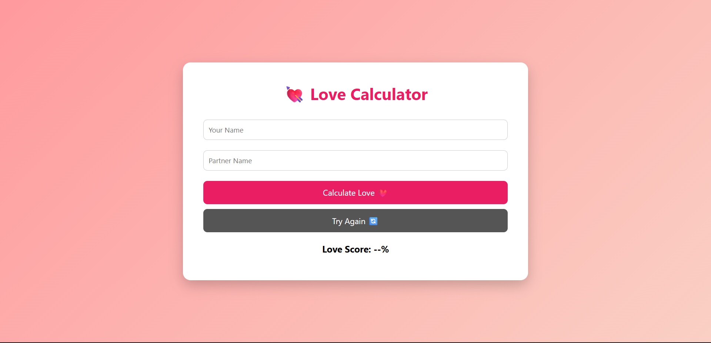

# 🎨 Crazy Web Mini Projects

A collection of creative, fun, and interactive web mini projects built using **HTML, CSS, and JavaScript**.
This repository showcases experimental ideas, festival-based projects, and unique UI interactions.

---

## 🚀 Projects

### ❤️ Love Calculator

* A fun project that calculates “love percentage” based on names
* Simple UI with dynamic result generation

📁 Folder: `love-calculator.`
🔗 Live Demo: *([click here](https://aswanth-mc.github.io/crazy-web-mini-projects/loveCalculator/))*

---

## 🛠 Tech Stack

* HTML5
* CSS3
* JavaScript (Vanilla)

---

## ✨ Features

* Interactive UI/UX
* Creative and experimental ideas
* Festival-based themed projects
* Beginner-friendly implementations

---

## 📌 Future Improvements

* Add more festival-based projects (Diwali, Eid, Christmas, etc.)
* Improve animations and UI design
* Convert projects into React apps
* Add backend features (user data, sharing, etc.)

---

## 📸 Preview

### Love Calculator

---

## 👨‍💻 Author

* GitHub: https://github.com/aswanth-mc
* LinkedIn: *www.linkedin.com/in/aswanth-m-c*

---

## ⭐ Support

If you like this repository, give it a ⭐ and follow for more creative projects!
